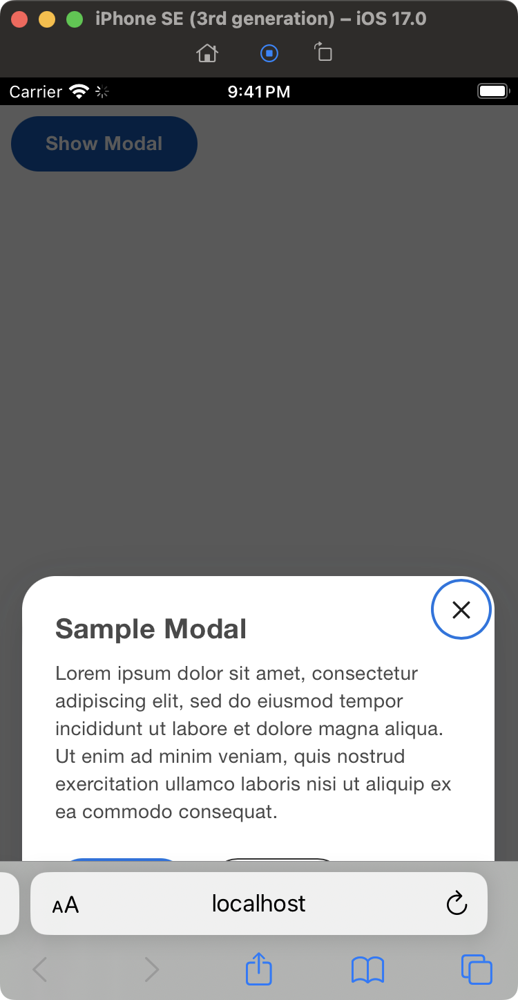

Demo of modal issue in mobile browsers. Based on Create React App.

[App.tsx](src/App.tsx) is based on sample code from the Canvas Kit storybook:
https://workday.github.io/canvas-kit/?path=/docs/components-popups-modal--basic

1. `npm install`
2. `npm start`
3. In a mobile simulator/emulator, browse to http://localhost:3000
4. Click the `Show Modal`

This is the result in an iPhone simulator:

